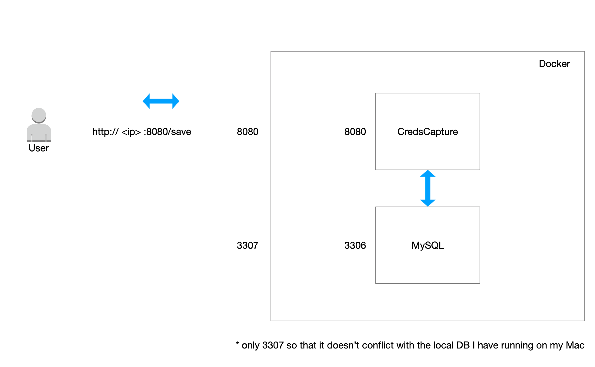

### CredentialsCapture

A simple REST End point to save some User Credentials a database done as a coding exercise. 



### Testing

# To Run the Unit Tests

```
./test.sh
```
When the system is running the following can be used as an Intergration test. 

```
./testapi.sh
```

# TODO:
* Increase the Unit Test coverage
* Add Unit Tests to the Controllers 

### Documentation 

To generate the Swagger documenation from the project 

```
./generatedocs.sh
```


### Running

# To run through docker, first build all the images. 

```./buildall.sh```

Once you have built the images 

```docker compose up```

### To access the database,  

```
docker exec -it credentialscapture_mysql_1 mysql -u sqluser -psqlpass
```

### Curl Commands.

```
curl --data '{"firstname":"Mark","lastname":"Ackroyd","country": "UK", "email": "my@email.com"}' "http://localhost:8080/save"
```

